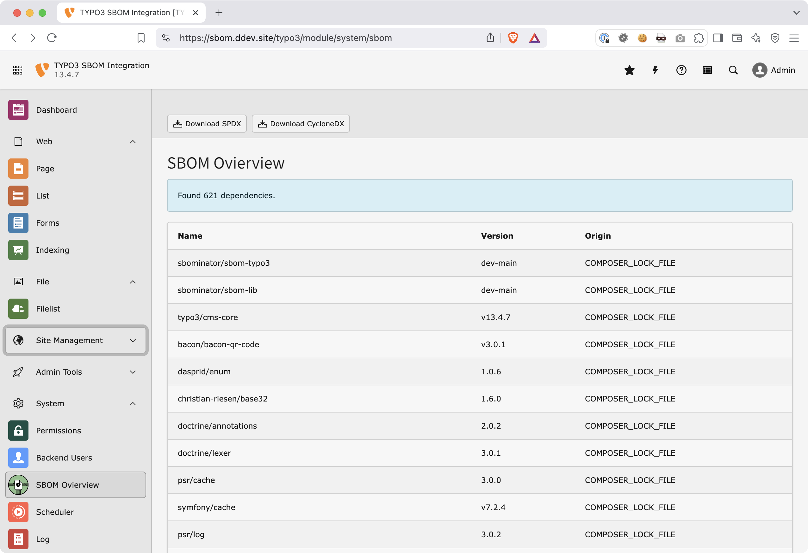

# TYPO3 SBOM

> [!NOTE]  
> This package is still experimental and to be considered a proof-of-concept.
> The SBOM contents still need to be validated and probably refined.

## Scope

This is a TYPO3 extension, that integrates the `SBOMinator/sbom-lib`, kick-started
during CloudFest Hackathon 2025. A dedicated backend module offers to download SBOM
files of all the software components the website is using. The formats SPDX and CycloneDX
are supported

## Installation

Requires at least TYPO3 v13.

```
composer req 'SBOMinator/sbom-typo3:@dev'
```

## Preview

Examples of the generated SPDX and CycloneDX file can be found in [Documentation/Examples/](tree/main/Documentation/Examples/)


